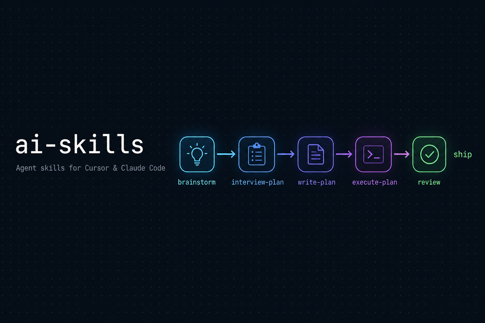
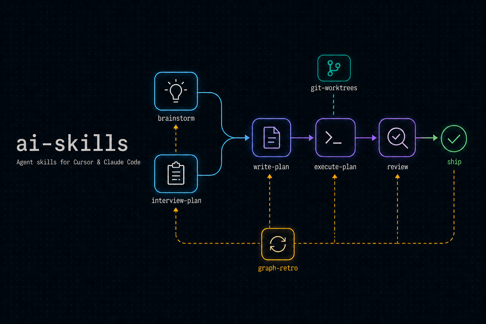
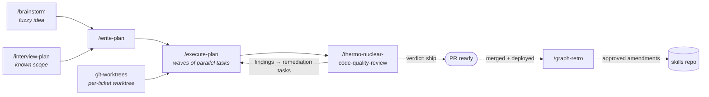
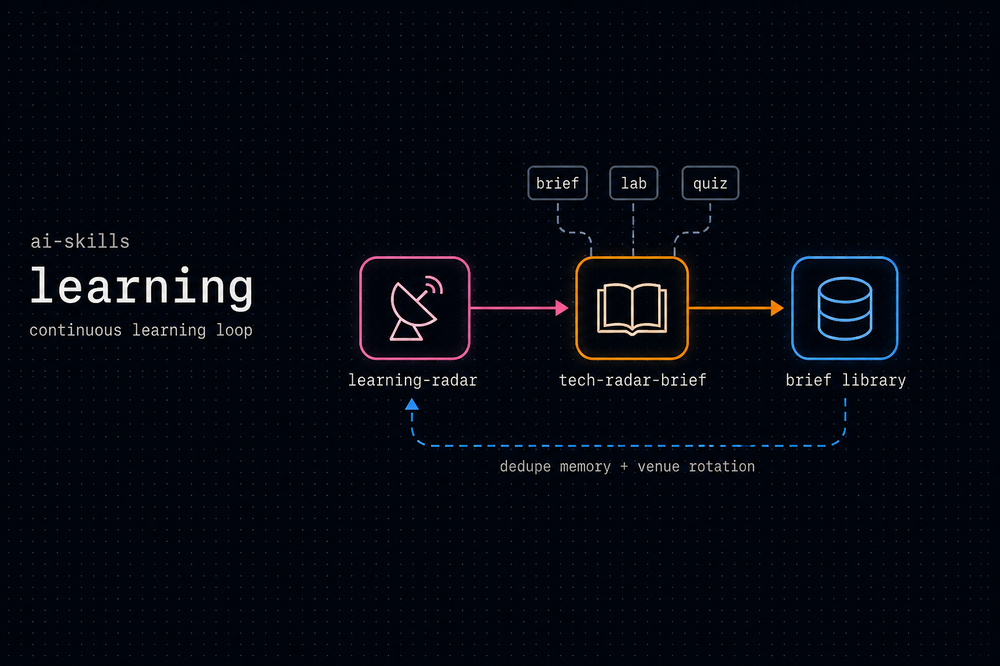
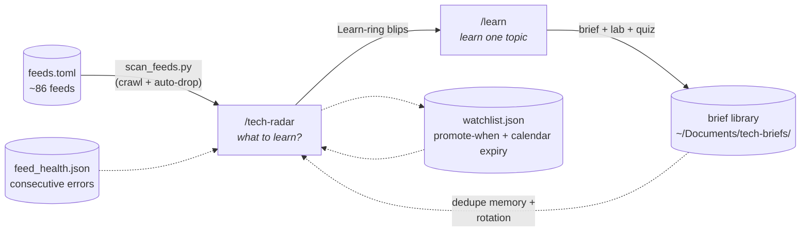

# ai-skills



[](LICENSE)
[](https://cursor.com)
[](https://claude.com/product/claude-code)
[](https://github.com/ayberkcansever/ai-skills/pulls)

Reusable AI agent skills/commands I use day-to-day, organized by category.
Each category holds the same skills in both **Cursor** and **Claude Code**
formats so you can drop them into whichever tool you use.

## Quick start

**Cursor** — copy all skills into your skills directory:

```bash
git clone https://github.com/ayberkcansever/ai-skills.git
cp -r ai-skills/*/cursor/* ~/.cursor/skills/
```

**Claude Code** — copy all commands:

```bash
git clone https://github.com/ayberkcansever/ai-skills.git
cp ai-skills/*/claude/*.md ~/.claude/commands/
```

Or install a single skill — each category section below lists its skills and
how they chain together.

## Categories

| Category | What it covers |
|----------|----------------|
| [`sdlc/`](#sdlc--software-development-lifecycle) | From fuzzy idea to merged, maintainable code — plan, execute, review, retro. |
| [`learning/`](#learning--continuous-learning-loop) | Decide what to learn next, then actually learn it — radar scans feeding topic briefs. |

---

## `sdlc/` — software development lifecycle



Agentic coding fails the same ways over and over. Each skill in this chain is
built around a counter:

- **Agents transcribe instead of discovering.** `interview-plan` reads the
  codebase *before* asking anything, then asks one code-grounded question at a
  time — a plan built only from the user's words is the exact failure mode it
  exists to prevent.
- **Agents overclaim.** `execute-plan`'s orchestrator re-runs every task's
  gate command itself before ticking a checkbox — a subagent's "done" is a
  claim, not evidence.
- **Agents work one task at a time in your checkout.** `execute-plan` runs in
  a per-ticket worktree — your own checkout is never touched, and two tickets
  can execute at once on one repo — and dispatches tasks in waves: everything
  whose dependencies are met and whose files don't overlap goes out together.
- **Reviews go stale.** `thermo-nuclear-code-quality-review` pins its verdict
  to the reviewed commit SHA; any later code commit re-opens the gate until
  the verdict is `ship` again at the new HEAD.
- **Agents never learn.** `graph-retro` mines each shipped ticket's plan for
  drift notes, blockers, and review findings, attributes each to the skill
  that should have prevented it, and proposes one-line amendments — applied
  only after human approval, committed to your skills repo with the evidence.

### Skills

| Skill | What it does |
|-------|--------------|
| `brainstorm` | Turns a fuzzy idea into an approved design through one-question-at-a-time dialogue, 2-3 proposed approaches, and a written spec — with an optional browser-based visual companion for mockups/diagrams. Gates on user approval before any implementation. |
| `interview-plan` | Interviews you one question at a time, reads the codebase first, and produces an **ambiguity-free** spec across business, backward-compat, and technical lenses. |
| `write-plan` | Turns the spec into a bite-sized, TDD-oriented implementation plan with exact files, code, and verification commands. |
| `execute-plan` | Executes the plan in a per-ticket worktree, dispatching each wave of independent tasks as parallel subagents, re-running each task's gate itself before ticking it, committing serially as it goes, then running the review gate until the verdict is `ship`. |
| `git-worktrees` | Sets up an isolated git worktree (detect/reuse → create or attach `.worktrees/<branch>` → baseline check) so execution never disturbs the user's checkout and several tickets can run at once. Called by `execute-plan` on every run. |
| `thermo-nuclear-code-quality-review` | A strict five-lens review — checks the diff against the spec's decisions (conformance/semantic drift), then flags over-engineering, spaghetti growth, architecture violations, and merge risks before the PR merges. |
| `graph-retro` | Post-deploy retrospective on the skill chain itself — extracts every drift note, blocker, and review finding from a shipped ticket's plan, attributes each to the skill that should have prevented it, and proposes human-gated amendments so the chain improves with every ticket. |

### Flow

Start with **either** `brainstorm` or `interview-plan` (not both required):



Pick the entry point that fits the task:

- **`brainstorm`** — fuzzy idea, no clear scope yet. Shapes it into an approved design.
- **`interview-plan`** — scope is roughly known. Stress-tests it into an ambiguity-free plan.

Use one, the other, or both (`brainstorm` to shape, then `interview-plan` to harden). `write-plan` onward is the same regardless of entry point.

After merge and deploy, `graph-retro` closes the loop: the chain's own
artifacts (drift notes, blockers, review findings) become proposals to improve
the skills themselves — the chain gets better with every ticket it ships.

### A taste

`interview-plan` doesn't ask generic questions — every question is grounded in
something it actually read in your codebase, always with a recommendation:

```
Q3 [compat]: Break sales, migrate it, or dual-write `legacyTarget` for one release?
Found: `tagLookup` read in `sales/.../x.ts:42` and `workflow/.../y.ts:88`;
       sales reads `legacyTarget`, which your change removes.
Recommendation: dual-write one release, then drop — zero-downtime.
Why: sales deploys on a different cadence; a hard break strands it.
```

Every decision lands in a spec file with a `Check:` line (a runnable command or
named test that proves it), every spec decision maps to a plan task, every task
commit carries a `[T<N>]` tag — a traceability chain from decision to diff.

### Notes

- These skills reference generic conventions (e.g. `docs/features/<TICKET-ID>/`,
  `docs/plans/<TICKET-ID>/`, `docs/specs/<TICKET-ID>/`, explicit-path commits).
  Adjust paths, ticket-key format, and commit tooling to match your own repo.
- `execute-plan` treats a worktree as the execution venue, not a fallback: it
  always runs in `.worktrees/<branch>` for the ticket. Add `.worktrees/` to
  your `.gitignore`. Because the WIP tiers (`docs/plans/`, `docs/specs/`) are
  gitignored, a fresh worktree does not contain them — the skill copies them
  in and then treats the worktree copy as the one live plan. Anything else
  untracked that your build needs (`.env`, local config) you must copy in too.
- Task parallelism is driven entirely by the plan's `Depends on:` and `Files:`
  metadata, so `write-plan`'s accuracy there sets your wall-clock time. A plan
  with no `Depends on:` lines executes sequentially by design — absent metadata
  is treated as unknown, not independent.
- `thermo-nuclear-code-quality-review` pins a dedicated **review model** so the
  reviewer never inherits the implementer session's model — fill in your chosen
  model slug in its "Pinned review model" section (write-plan and execute-plan
  reference that section instead of hardcoding a slug).
- Examples use Python/`pytest` and a `handler → use case → repository` layering
  purely as illustration — apply them to whatever stack your repo uses.
- `graph-retro` commits approved amendments to your skills directory — keep
  that directory a git repo (e.g. `git init ~/.cursor/skills`) so every skill
  change is a reviewed, revertible commit with its evidence in the message.
  Amendments land in the *installed* copy; periodically diff it against this
  repo and upstream the keepers, or the two will drift.
- `brainstorm` (Cursor variant) ships its **visual companion** — `visual-companion.md`
  plus a `scripts/` folder with a small local Node server for showing mockups in
  the browser. It writes session state under `.superpowers/brainstorm/` in your
  project; add `.superpowers/` to your `.gitignore`. The companion is optional —
  the skill works text-only without it.

---

## `learning/` — continuous learning loop



A chain aimed at the engineer rather than the ticket: decide **what** to learn
next, then actually learn it — with the output of one skill feeding the other
in both directions.

### Skills

| Skill | What it does |
|-------|--------------|
| `tech-radar` | Answers "what should I learn next?" for a principal software + AI engineer. A deterministic stdlib crawler (`scripts/scan_feeds.py`, driven by an editable `feeds.toml` registry of ~86 feeds — AI labs, cloud/platform, every major language, databases, famous framework releases, production engineering blogs, security, observability, web platform, HN consensus plus a sub-threshold discovery band, Lobsters, endoflife.date) pulls the window into a dated intake split into reviewable items and auto-dropped ones with reasons on disk; novelty and security patterns can never be auto-dropped. The agent dispositions 100% of the reviewable set (keeps + coded drops in `triage.json`), confirms adoption evidence, merges a calendar-expiring watchlist (`quiet_expiry_days`, with optional `review_after`), and places every candidate on a Thoughtworks-style radar — four quadrants (Techniques / Platforms / Tools / Languages & Frameworks) × four rings (Learn / Try / Watch / Skip) — rendered as an interactive SVG radar with numbered blips and per-blip writeups. Whole-landscape balance enforced (AI one strand, not the default). The Learn ring is the learn-next answer. Supports full scans and quick watchlist-update scans. |
| `learn` | Learns one topic to a correct 101 level in minimal time. Researches recent primary sources, produces a brief (101 mental model, what changed, verdict) saved to a searchable HTML library, then offers a learn path, a run-and-observe hands-on lab (code ships complete and verified; you predict, run, and explain back), and a quiz. |

### Flow

The two share one library (`~/Documents/tech-briefs/`): briefs produced by
`learn` are the radar's dedupe memory, and each scan's ranked picks are the
learn skill's input queue. The radar also keeps a persistent watchlist between
scans (candidates too real to discard but not yet Learn-rankable — calendar
expiry, not scan-count), and rotates its manual sources and wildcard searches
based on the previous scan's coverage.



### Notes

- Output goes to `~/Documents/tech-briefs/` (briefs, radar scans, intake files —
  `titles.txt` / `drops.txt` / `.json` / `triage.json`, watchlist,
  `feed_health.json`, and a self-rebuilding `index.html`) — never into the
  current repo.
- The radar's coverage is a registry edit, not a prompt edit: add or drop a
  source by editing `feeds.toml`; the crawler and skill pick it up unchanged.
  Sources without machine-readable feeds are `type = "manual"` entries the
  agent covers with a search hint, so nothing is silently skipped. Broken or
  truncated feeds are reported (and consecutive failures remembered in
  `feed_health.json`) rather than skipped quietly.
- Auto-drop rules live in `scripts/scan_feeds.py` and are covered by
  `scripts/test_scan_feeds.py` — change a pattern, run the tests.
- The Claude variants are text ports — their supporting files
  (`assets/`, `references/`, `template.html`, `lab-template.html`,
  `notes-template.html`, `feeds.toml`, `scripts/`) ship in the matching
  `learning/cursor/<skill>/` folder; install the Cursor variant alongside
  or adjust the paths.
- `tech-radar` expects `learn` installed as a sibling
  (`~/.cursor/skills/learn/`) — install both together.

---

## Layout

```
<category>/                 # sdlc/, learning/
  cursor/<skill>/SKILL.md   # Cursor skill format (+ templates/scripts)
  claude/<skill>.md         # Claude Code command format
```

Adding a category is additive: a new folder, a new README section, a new
banner — existing categories stay untouched.

## Notes

- The Cursor and Claude variants are kept in sync but may differ slightly in
  formatting to match each tool's conventions.

## Credits

The planning/brainstorming skills are adapted from the open-source
[Superpowers](https://github.com/obra/superpowers) project (MIT). The visual
companion server scripts under `sdlc/cursor/brainstorm/scripts/` originate there.

## License

MIT — use, adapt, and share freely.
